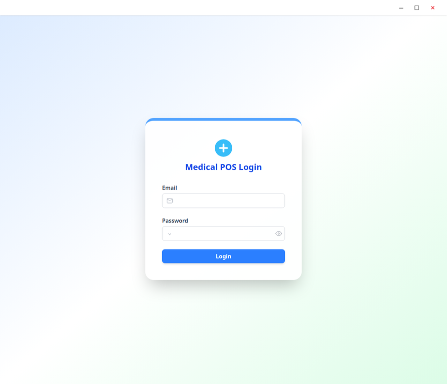

# Medical POS

[](https://github.com/Usamabhanbhro/medical-pos/actions/workflows/ci.yml)

Medical POS is a desktop-oriented point-of-sale and inventory management application for medical stores, pharmacies, and healthcare clinics. The repository contains an Electron shell, a React and TypeScript frontend, and a FastAPI backend that persists operational data in MongoDB.

## Screenshots

### Login



The login screen is the application’s authenticated entry point and was captured from the locally running Vite application without real credentials or personal data.

## Capabilities

The implemented application includes authenticated access, medical item management, doctor management, checkout and sale creation, patient history, sales reporting, expense ledger management, store settings, user profile settings, and administrative user management. Several workflows require a configured MongoDB connection and an authenticated backend session.

## Technology Stack

| Area | Technology |
| --- | --- |
| Desktop shell | Electron |
| Frontend | React 19, TypeScript, Vite, Tailwind CSS |
| Backend | FastAPI, Uvicorn, Python 3.10+ |
| Database | MongoDB through Motor and PyMongo |
| Authentication | Session-based API flow with JWT-related dependencies |
| Reporting | `openpyxl` |
| Package managers | npm and pip |

## Repository Structure

```text
.
├── .github/workflows/ci.yml       # GitHub Actions validation workflow
├── docs/screenshots/              # Authentic application screenshots
├── medical-pos-main/
│   ├── application/               # Electron shell and frontend
│   │   └── frontend/              # React/Vite application
│   └── backend/                   # FastAPI service and MongoDB access
└── README.md
```

## Prerequisites

Install Node.js 22 or a compatible current LTS release, Python 3.10 or newer, and access to a MongoDB deployment. The backend reads `MONGODB_ATLAS_URL` and optionally `MONGODB_DB_NAME` from its environment. Authentication also uses `SECRET_KEY`, `ALGORITHM`, and `ACCESS_TOKEN_EXPIRE_MINUTES`.

Do not commit secrets. Create a local environment file under `medical-pos-main/backend/.env`; that path is ignored by Git.

## Installation

Install the frontend dependencies:

```bash
cd medical-pos-main/application/frontend
npm ci
```

Install the backend dependencies in a virtual environment:

```bash
cd medical-pos-main/backend
python3 -m venv .venv
source .venv/bin/activate
python -m pip install --upgrade pip
python -m pip install -r requirements.txt
```

## Running Locally

Start the FastAPI backend from `medical-pos-main/backend`:

```bash
source .venv/bin/activate
uvicorn app:app --reload --host 0.0.0.0 --port 8000
```

Start the frontend in a separate terminal. Set `VITE_BACKEND_URL` to the address of the backend when it is not using the application’s default deployment URL:

```bash
cd medical-pos-main/application/frontend
VITE_BACKEND_URL=http://localhost:8000 npm run dev -- --host 0.0.0.0
```

The frontend is then available at `http://localhost:5173/`. The backend exposes its OpenAPI documentation at `http://localhost:8000/docs`.

The Electron wrapper can be started after the frontend build dependencies are installed:

```bash
cd medical-pos-main/application
npm ci
npm run start
```

## Validation Commands

The CI workflow runs the checks that are currently defined by the repository:

```bash
cd medical-pos-main/application/frontend
npm ci
npm run lint
npm run build

cd ../../backend
python -m pip install -r requirements.txt
python -m compileall -q .
```

There is currently no committed automated unit-test suite or Docker configuration in the repository, so the workflow does not invent test or container stages that cannot be executed against the existing project.

## CI/CD

GitHub Actions runs on pushes to `main` and on pull requests. The workflow uses least-privilege read-only repository permissions, caches npm and pip dependencies, lints and builds the frontend, installs backend dependencies, and compiles backend modules to detect syntax errors. It does not publish artifacts or images because no release or registry strategy is configured in the repository.

## Configuration Notes

The frontend’s API client accepts `VITE_BACKEND_URL` at build or development time. The backend’s database initialization creates MongoDB indexes during application startup, so a reachable MongoDB instance is required for full API operation. Use test data and local credentials for development; never use production credentials in screenshots or local validation.

## License

No license file is currently committed in the repository. Add the project’s intended license before distributing the software publicly.
